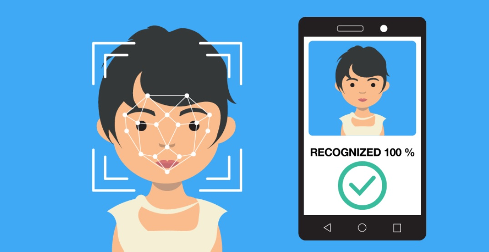

# Mes propositions de sujets

Voici, les sujets que j’aimerais traiter dans le cadre du travail.

## Le système de reconnaissance faciale 

Une technologie qu'on a dans les téléphones mais aussi en chine dans une version plus extrême. De nouvelles technologies qui peuvent contribuer à renforcer notre sécurité, mais à quel prix? Certains défendent les droits à la vie privé et certains à la liberté publique. Prendre ce sujet reviendrait à comprendre cette technologie qui fera indéniablement parti de notre futur. 

*Quelques ressources supplémentaires*

- [Page Wikipédia](https://fr.wikipedia.org/wiki/Syst%C3%A8me_de_reconnaissance_faciale)
- ... à venir

## La 5G 

Par curiosité voyant la grosse polémique qu'a sucité la prochaine sorti de la 5G.
Ne sachant pas réellement ce que c'est, d'un point de vue technique, je me suis dis que c'était l'occasion de s'y intéresser de plus près et de comprendre cette technologie.

*Quelques ressources supplémentaires*

- [Page Wikipédia](https://fr.wikipedia.org/wiki/5G)
- ...à venir

##
